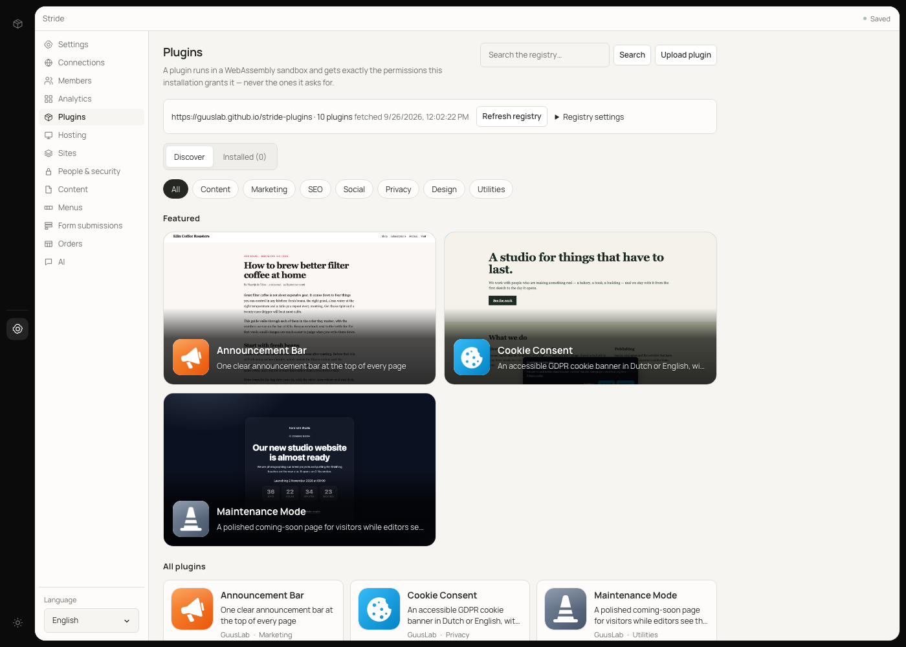
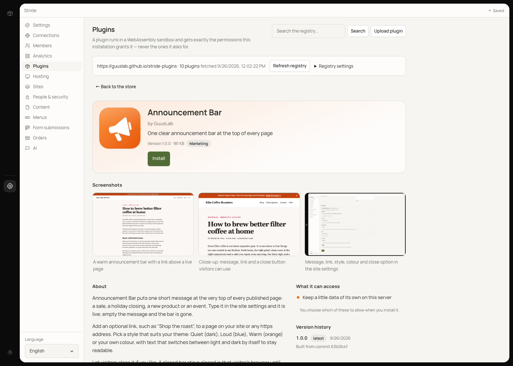

<div align="center">

# Stride Plugins

**The official plugin registry and store for [Stride](https://www.npmjs.com/package/@guuslab/stride).**

Every plugin here is WebAssembly, sandboxed, permission-scoped, signed, and
rebuilt from source byte for byte before it is listed.

[Browse the gallery](https://guuslab.github.io/stride-plugins/) ·
[Build a plugin](#build-a-plugin-in-5-minutes) ·
[Submit a plugin](#submitting-a-plugin) ·
[Contributing guide](CONTRIBUTING.md)

</div>

---

## Installing from the store

1. In the Stride editor, open **Plugins**.
2. Browse or search the store. Each listing shows the icon, screenshots, what
   the plugin does and exactly which permissions it asks for.
3. Click **Install**, review the permission screen and untick anything you do
   not want to grant. A plugin that is refused a permission is told "no" at
   run time; it never gets to ask again behind your back.
4. Tick **Turn it on after installing**, or **Enable** it later. Left
   unticked, a plugin is installed switched off.

| The store | A plugin page | The result on a published page |
| --- | --- | --- |
|  |  |  |

Your server downloads the module itself, checks its SHA-256 against the signed
index and its publisher's signature, and refuses anything that does not match.

Stride trusts this registry by default and fetches it the first time you open
**Plugins**. To set it explicitly, or on an older Stride:

```sh
STRIDE_PLUGIN_REGISTRY_URL=https://guuslab.github.io/stride-plugins/index.json
STRIDE_PLUGIN_REGISTRY_KEY=eb8b920592e7f58a9a76ab0e357e13e6492ddb37f7aff42a3d8416c9a087f8a2
```

## Plugins

| | Plugin | What it does | Permissions |
|---|---|---|---|
|  | [**Announcement Bar**](sources/announcement) | One clear announcement bar at the top of every page | `storage` |
|  | [**Breadcrumbs**](sources/breadcrumbs) | A breadcrumb trail above every page, with structured data for Google. | `storage`, `read-pages` |
|  | [**Celebrate**](sources/celebrate) | Confetti for your thank-you pages, after an order, sign-up or booking. | `storage` |
|  | [**Cookie Consent**](sources/cookie-consent) | An accessible GDPR cookie banner in Dutch or English, with no third parties | `storage` |
|  | [**Copy Code**](sources/copy-code) | A copy button on every code block, with a language label and line numbers. | `storage` |
|  | [**Countdown Banner**](sources/countdown-banner) | Count down to your sale, launch or order deadline, then step aside. | `storage` |
|  | [**Custom Code**](sources/custom-code) | Add analytics, verification tags and widgets to every page. No theme edits. | `storage` |
|  | [**Dark Mode Toggle**](sources/dark-mode-toggle) | A light and dark switch that follows the device and never flashes. | `storage` |
|  | [**External Links**](sources/external-links) | Links to other sites open in a new tab, safely, with a small arrow. | `storage` |
|  | [**Glossary**](sources/glossary) | Explain jargon where it appears: dotted underlines that show a definition. | `storage` |
|  | [**Heading Anchors**](sources/heading-anchors) | A # link beside every heading. Click to copy a link to that section. | `storage` |
|  | [**Image Lightbox**](sources/image-lightbox) | Click any image to see it large, with captions, arrows and swipe. | `storage` |
|  | [**Instant Pages**](sources/instant-pages) | Pages load while visitors point at a link, and fade in smoothly. | `storage` |
|  | [**Last Updated**](sources/last-updated) | Shows when each page last changed, in Dutch or English, under the title. | `storage`, `read-pages` |
|  | [**Listen**](sources/listen) | A Listen button that reads long pages aloud, highlighting each paragraph. | `storage` |
|  | [**Lite Video**](sources/lite-video) | YouTube and Vimeo videos that load only when a visitor presses play. | `storage` |
|  | [**Maintenance Mode**](sources/maintenance-mode) | A polished coming-soon page for visitors while editors see the real site | `storage` |
|  | [**Privacy Map**](sources/map-embed) | An OpenStreetMap that loads only when a visitor asks for it. | `storage` |
|  | [**Mobile Action Bar**](sources/mobile-action-bar) | Call, email, directions and booking, one tap away on phones. | `storage` |
|  | [**Opening Hours**](sources/opening-hours) | Your opening hours as a neat table, with a live Open now badge. | `storage` |
|  | [**Print Friendly**](sources/print-friendly) | Pages that print cleanly: no menus or banners, full link addresses, tidy breaks. | `storage` |
|  | [**Promo Popup**](sources/promo-popup) | One friendly popup for a sale or newsletter. Never pushy. | `storage` |
|  | [**QR Code**](sources/qr-code) | A QR code for every page, for menus, flyers, posters and printed recipes. | `storage` |
|  | [**Quote Share**](sources/quote-share) | Select a sentence and share it as a quote. Links open with it highlighted. | `storage` |
|  | [**Reading Progress**](sources/reading-progress) | A slim reading progress bar and a back-to-top button for long pages. | `storage` |
|  | [**Reading Time**](sources/reading-time) | Shows readers how long a page takes, like "4 min read", under the title. | `storage` |
|  | [**Related Pages**](sources/related-pages) | Related reading at the end of every article, matched on topics and titles. | `read-pages`, `storage` |
|  | [**Schema Markup**](sources/schema-markup) | JSON-LD for your business, website and blog posts, ready for Google rich results | `storage` |
|  | [**Scroll Reveal**](sources/scroll-reveal) | Content fades and slides into place as visitors scroll to it. | `storage` |
|  | [**SEO Inspector**](sources/seo-inspector) | A 0-100 SEO score and clear warnings for every page, checked on save. | `storage`, `write-pages` |
|  | [**Site Search**](sources/site-search) | A search box for your whole site. Press ⌘K and find any page as you type. | `storage`, `read-pages` |
|  | [**Social Share**](sources/social-share) | Privacy-friendly share buttons under every article. No trackers. | `storage` |
|  | [**Table of Contents**](sources/table-of-contents) | A linked table of contents for long pages, built from your headings. | `storage` |
|  | [**WhatsApp Chat**](sources/whatsapp-chat) | A floating WhatsApp button with a preset message and opening hours | `storage` |

## Build a plugin in 5 minutes

A plugin is a small WebAssembly module plus a `stride-plugin.json` manifest.
It hooks into page rendering, saving or publishing, and adds settings panels.
The `stride` CLI does all of it: scaffolding, running, testing and signing.
It comes from npm and runs on macOS (Apple silicon), Linux x64 and Linux arm64.

**1. Install the CLI.**

```sh
npm i -g @guuslab/stride        # or run any command as: npx @guuslab/stride <command>
stride --version
```

`stride upgrade` keeps it current. `stride completions zsh` (or `bash`,
`fish`) prints tab completion.

**2. Scaffold a plugin.** Rust is the default, and it is what this store lists:

```sh
rustup target add wasm32-unknown-unknown
stride plugin new my-plugin
cd my-plugin
```

TypeScript works too, with `stride plugin new my-plugin --lang ts`. The
project imports from `@guuslab/stride/pdk` and has `@guuslab/stride` as a
dev dependency, so `npm test` runs `stride plugin test .` without a global
install. Building it also needs
[`extism-js`](https://github.com/extism/js-pdk#install-the-compiler) and
[Binaryen](https://github.com/WebAssembly/binaryen) on your `PATH`; the
scaffold's README says how to install them.

**3. Edit it.** You work in two files:

- `stride-plugin.json` declares the plugin's name, permissions, hooks and
  settings panels.
- `src/lib.rs` (or `src/index.ts`) implements the hooks. The scaffold's
  `on_page_render` appends a comment to every page, a working starting point.

The generated `README.md` is where you justify each permission you ask for.

**4. Run it.**

```sh
./build.sh                  # TypeScript: npm run build
stride plugin dev .
```

`dev` loads the module in the real sandbox with every permission it asks for.
It runs each hook and panel against sample input and prints what they
returned and stored.

**5. Test it.**

```sh
stride plugin test .
```

This runs the checks the registry runs: the manifest, the module, every
promised export, and every hook with all permissions and with none. It exits
non-zero on failure, so it can gate your CI.

To try the plugin in your own Stride before it is in any store, open
**Plugins → Upload plugin** in the editor and upload `stride-plugin.json` and
`plugin.wasm`. An upload is installed as unsigned.

<a id="submitting-a-plugin"></a>

## Submit it to the store

Contributors never need the registry key, and do not need a key of their own
either. The short version is below; [CONTRIBUTING.md](CONTRIBUTING.md) has
every field and command.

1. **Fork this repository** and put your source in `sources/<id>`, following
   the conventions of the plugins already there:

   ```sh
   stride plugin new my-plugin --dir sources/my-plugin --pdk ../../pdk-rust
   cp tools/rust-toolchain.toml sources/my-plugin/
   (cd sources/my-plugin && cargo generate-lockfile)
   ```

   - Set `"publisher": "guuslab"` and the `homepage` in `stride-plugin.json`.
   - Commit `Cargo.lock`.
   - Build with `tools/build-plugin.sh my-plugin`, the same reproducible build
     CI uses, then run `stride plugin test sources/my-plugin`.

2. **Add the store listing** in `plugins/<id>/`:

   ```
   plugins/<id>/plugin.json          manifest (same as stride-plugin.json), publisher, store; no release
   plugins/<id>/icon.png             512x512 PNG, at most 256 KB
   plugins/<id>/screenshots/NN.png   1600x1000 PNG, at most 1.5 MB, two to five of them
   ```

   The `store` object carries a tagline, a long description, screenshot
   captions, categories and an accent colour. See
   [CONTRIBUTING.md](CONTRIBUTING.md#4-add-the-store-listing) for the exact
   shape and limits.

3. **Open a pull request.** CI (`node tools/verify.mjs`) checks your store
   metadata and images, and rebuilds every listed plugin to confirm each
   still matches its signed hash. Run `node tools/verify.mjs --no-build`
   first to catch the same problems locally.

4. **The maintainer takes it from there.** They review the permissions
   against your description, merge, and produce the reference build on
   x86_64 Linux. They sign the release with the store's publisher key, sign
   the index with the registry key, and publish. From then on, CI rebuilds
   your source on every push and refuses any byte that differs.

**TypeScript plugins** are not listed in this store yet. The reproducible
reference build is Rust only. They run fine in Stride and in
[your own store](#run-your-own-store).

**Publisher keys are optional.** If you want your releases signed with your
own key, you can create one:

```sh
stride plugin keygen --out ~/.stride/<you>.key
```

Then add `publishers/<you>.json` with its public half. Signing yourself means
reproducing the reference build exactly, so
[CONTRIBUTING.md](CONTRIBUTING.md#keys) explains the catch. Otherwise the
maintainer signs, and that is the normal path.

## Run your own store

The CLI that builds this store builds any store: for an agency, a company,
or plugins you do not want public.

1. **Make a registry key.** Keep the file off every server:

   ```sh
   stride plugin keygen --out ~/.stride/my-registry.key   # prints the public key
   ```

2. **Lay out a registry directory** like this one, with one
   `plugins/<id>/plugin.json` per plugin. Sign each release with a publisher
   key (another `stride plugin keygen`):

   ```sh
   stride plugin publish path/to/plugin --key ~/.stride/publisher.key --base-url https://plugins.example.com
   ```

   This prints the submission: manifest, publisher and a signed release.
   Save everything above the `# release digest` line as
   `plugins/<id>/plugin.json`, and add a `store` object if you want one.
   TypeScript plugins are fine here.

3. **Build and sign the index:**

   ```sh
   stride plugin index . --key ~/.stride/my-registry.key --base-url https://plugins.example.com
   ```

   It checks every submission and its store images, then writes
   `site/index.json` (or the file named by `--out`).

4. **Host it over https.** The server needs these files:
   - `index.json`
   - `plugins/<id>/<version>/plugin.wasm` and
     `plugins/<id>/<version>/stride-plugin.json`
   - `plugins/<id>/icon.png` and `plugins/<id>/screenshots/NN.png`

   All of them go under the `--base-url`. This repository's `site/` and
   [`pages.yml`](.github/workflows/pages.yml) do exactly that on GitHub Pages.

5. **Point Stride at it.** There are two ways:
   - Set these environment variables on the server:

     ```sh
     STRIDE_PLUGIN_REGISTRY_URL=https://plugins.example.com/index.json
     STRIDE_PLUGIN_REGISTRY_KEY=<the public key from step 1>
     ```

   - Or open **Plugins → Registry settings** in the editor and fill in
     **Registry address (index.json)** and **Registry public key**.

   Then click **Refresh registry**.

An installation trusts exactly one registry key. Your own registry replaces
this one; the two are not combined.

## This repository

```
plugins/<id>/        submissions and store images
sources/<id>/        source of every listed plugin (Rust, wasm32-unknown-unknown)
pdk-rust/            the Stride Rust PDK, vendored so sources/ rebuilds on its own
publishers/          publisher records
site/                what GitHub Pages serves: index.json, modules, images, the gallery
tools/               build, render, demo and verification scripts
```

| Tool | Usage |
|---|---|
| `tools/build-plugin.sh <id>` | reproducible release build of `sources/<id>` into `sources/<id>/plugin.wasm`, prints SHA-256 and size |
| `node tools/icon.mjs <in.svg> <out.png> [w h]` | render an SVG to PNG (512x512 by default; `1600 1000` for screenshots) |
| `node tools/preview.mjs <id> <page.html> <out.html> [values.json]` | run a plugin's page hook over a page, with its settings seeded from a JSON file |
| `node tools/verify.mjs [--no-build]` | what CI runs: rebuild and compare hashes, check images and the published copies under `site/` |
| `node tools/gallery.mjs` | render `site/index.html` and this README's plugin table from `site/index.json` |
| `tools/demo-server.sh <port> <workdir>` | start a throwaway Stride with a fresh database (maintainers; see its header) |
| `node tools/install-local.mjs <port> <sourceDir>` | sideload, grant and enable a plugin on that server |
| `node tools/publish-new.mjs [<id>...]` | maintainers: reference-build, sign and lay out every unsigned submission, then sign the index |

Run `npm install` once for `icon.mjs` and `preview.mjs`. The scripts that run
Stride use `stride` from your `PATH`. Point `STRIDE_BIN` at another binary
to override it, for example `STRIDE_BIN="$(command -v stride)"`.

**Publishing (maintainers).** `node tools/publish-new.mjs` signs every
submission that has no release yet and does everything below; see the comment
at its top for the keys it reads. By hand, after merging a submission:

1. Copy the module and manifest to `site/plugins/<id>/<version>/`.
2. Copy the images to `site/plugins/<id>/`.
3. Run:

   ```sh
   stride plugin index . --key ~/.stride/stride-registry.key --base-url https://guuslab.github.io/stride-plugins
   node tools/gallery.mjs
   ```

4. Push.

The registry key never enters this repository.

## Licence

The registry tooling and first-party plugins are [MIT](LICENSE). Third-party
plugins carry the licence stated in their own manifest.
